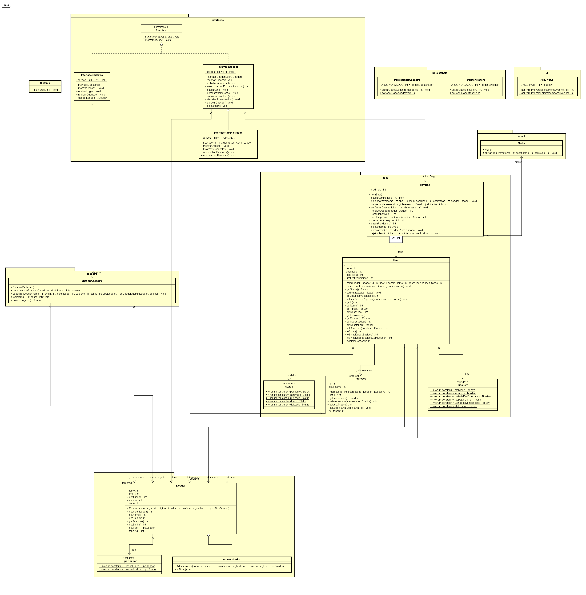

# Doe Fácil

Sistema de gerenciamento de doações de itens em geral, com funcionamento inteiramente baseado em Interface de Linha de Comando. Este é o trabalho prático da disciplina Qualidade de Produto de Software, ministrada pela professora Kecia Aline Marques Ferreira, do Centro Federal de Educação Tecnológica de Minas Gerais (CEFET-MG).

Integrantes do grupo deste trabalho:
  - Arthur Sabioni
  - Julia Bindi
  - Marcus Zuba

## Vídeo de Demonstração do Sistema

O vídeo de demonstração do sistema pode ser visualizado no seguinte link: https://youtu.be/_zCu1_0Sppo

## Como Executar o Sistema

Para executar o sistema, uma forma fácil é por meio do Visual Studio Code, seguindo os passos abaixo:

- Instale o [VS Code](https://code.visualstudio.com/)
- No VS Code, instale o [Extension Pack for Java](https://marketplace.visualstudio.com/items?itemName=vscjava.vscode-java-pack)
- Abra este projeto
- Execute o arquivo `Sistema.java`

## Diagrama de Classes

O diagrama de classes deste sistema pode ser visualizado abaixo (dê zoom para uma melhor visualização dos detalhes):

